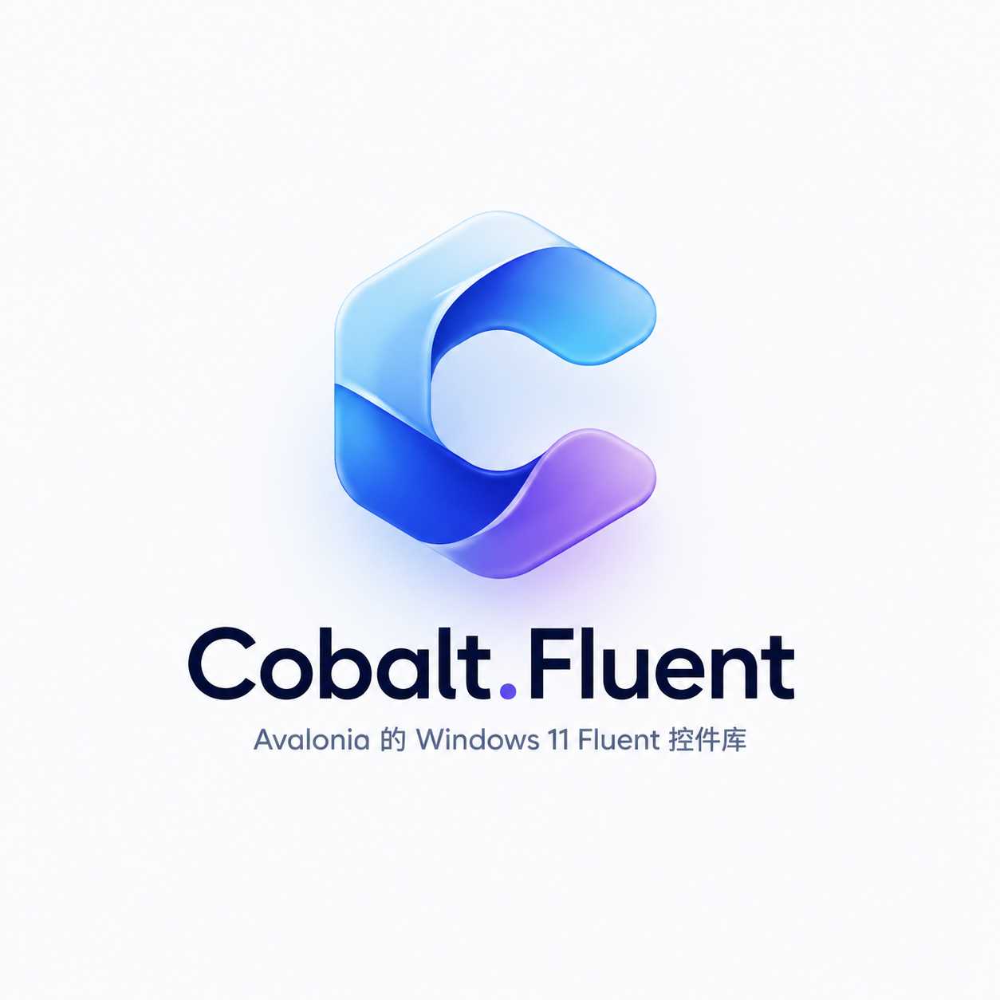
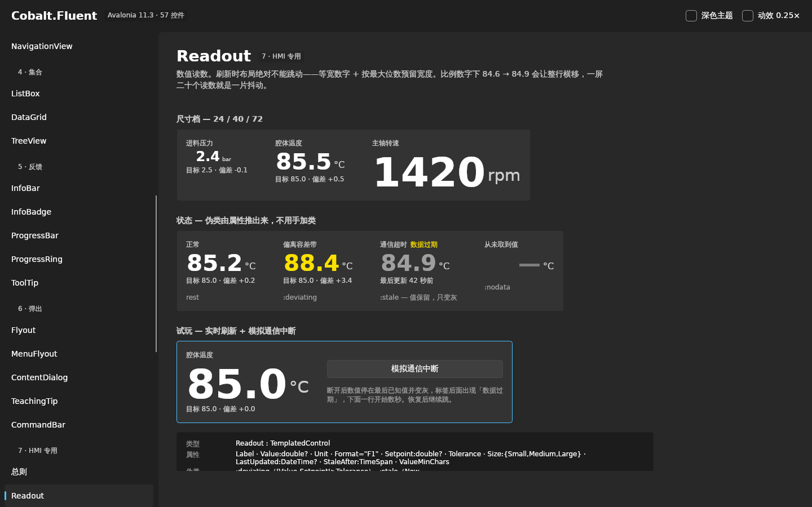
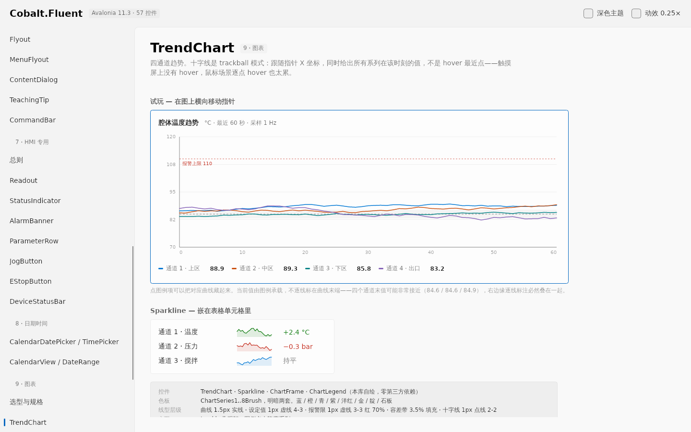
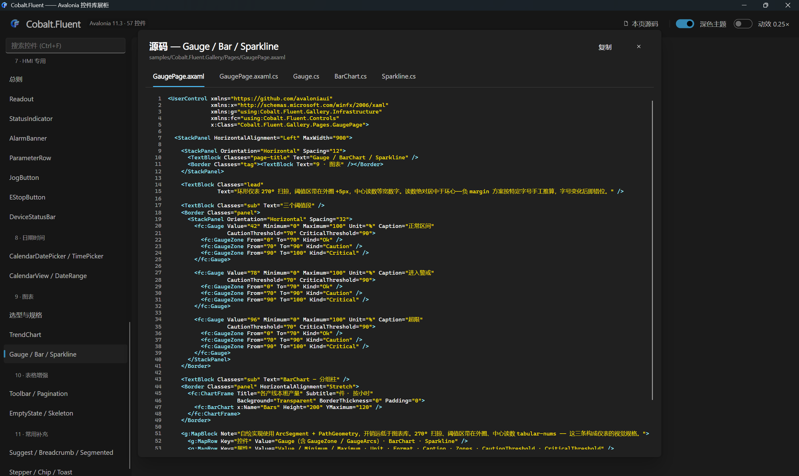

<div align="center">



# Cobalt.Fluent

**A Windows 11 Fluent implementation for Avalonia**

61 controls · 11 groups · light and dark themes · zero third-party dependencies · industrial HMI control set included

[](https://github.com/RoorJiaMo/CobaltFluent/actions/workflows/build.yml)
[](LICENSE)
[](https://avaloniaui.net)
[](https://dotnet.microsoft.com)

**English** · [简体中文](README.zh-CN.md)



</div>

---

## Overview

Cobalt.Fluent implements the Windows 11 Fluent visual specification in full on Avalonia 11.3, and adds a dedicated control set built for process-control interfaces.

General-purpose control libraries fall short in industrial HMI applications in recurring ways: numeric updates cause layout jitter, alarms rely on flashing, jog buttons have incomplete stop conditions, and parameter writes echo the entered value rather than the value the device actually accepted. These are safety concerns, not cosmetic ones. This library implements the corresponding safety semantics inside the controls and pins them with regression tests.

<table>
<tr>
<td width="25%" valign="top">

### Zero third-party dependencies

References only Avalonia itself, `Avalonia.Themes.Fluent` and `Avalonia.Controls.DataGrid` — all first-party packages. Charts are custom-drawn; icons are built-in vector paths.

</td>
<td width="25%" valign="top">

### Verifiable specification

Most controls ship a state matrix. CI renders all 48 gallery sections headlessly into 96 screenshots; a render failure fails the build.

</td>
<td width="25%" valign="top">

### Built for embedded targets

No dependency on the Segoe Fluent Icons font. Motion is limited to transform, opacity and brush transitions — nothing animates layout. Acrylic and shimmer effects can be turned off.

</td>
<td width="25%" valign="top">

### Tested safety semantics

E-stop latching, multi-source jog stop, event-driven heartbeat and stale-value retention are all covered by regression tests.

</td>
</tr>
</table>

---

## Getting started

```bash
# Not on nuget.org yet. Until the first release, reference the project directly:
dotnet add reference path/to/src/Cobalt.Fluent/Cobalt.Fluent.csproj
```

```xml
<!-- App.axaml -->
<Application xmlns="https://github.com/avaloniaui"
             xmlns:fc="using:Cobalt.Fluent">
  <Application.Styles>
    <fc:CobaltFluentTheme />
  </Application.Styles>
</Application>
```

Switch themes through `Application.Current.RequestedThemeVariant` (`Light` / `Dark` / `Default`).
Controls added by this library live in the `Cobalt.Fluent.Controls` namespace:

```xml
xmlns:fc="using:Cobalt.Fluent.Controls"
```

```xml
<fc:Readout Label="Chamber temperature" Value="85.5" Unit="°C"
            Setpoint="85.0" Tolerance="1.0" Size="Large" />

<fc:JogButton Content="Jog X+" StopCommand="{Binding StopAxis}"
              WatchdogTimeout="0:0:0.5" />

<fc:TrendChart Series="{Binding Channels}" IsTrackballEnabled="True" />
```

---

## Gallery

The gallery application contains 48 sections. A control section is laid out as the visual specification, an interactive demo, and a reference table of resource keys and pseudo-classes; 22 of them also freeze every pseudo-class side by side in a state matrix. Five further sections — the design baseline, typography, the icon list, and the introductions to groups 7 and 9 — carry prose and reference material rather than a control demo.

<table>
<tr>
<td width="50%"></td>
<td width="50%"></td>
</tr>
<tr>
<td align="center"><sub>Light theme · Group 9, Charts</sub></td>
<td align="center"><sub>Dark theme · Group 7, Industrial HMI</sub></td>
</tr>
</table>

Every page offers **View source**: the sample XAML and C# for the current page, plus the `ControlTheme` and control class as they exist in the library — with line numbers, syntax highlighting and one-click copy.



```bash
dotnet run --project samples/Cobalt.Fluent.Gallery
```

---

## Control coverage

11 groups. Baseline desktop control height is 32px.

<details>
<summary><b>Full list (61 controls)</b></summary>

<br>

| Group | Controls | Origin |
|---|---|---|
| **2** Basic input | Button · ToggleButton · SplitButton · DropDownButton · HyperlinkButton · TextBox · NumberBox · ComboBox · CheckBox · RadioButton · ToggleSwitch · Slider | Avalonia built-ins re-themed by this library |
| **3** Containers | Card · SettingsCard · SettingsGroup · Expander · TabControl · TabView · NavigationView | Card / SettingsCard / SettingsGroup / TabView / NavigationView implemented here |
| **4** Collections | ListBox · DataGrid · TreeView | ListBoxItem template rewritten (adds the selection indicator bar) |
| **5** Feedback | InfoBar · InfoBadge · ProgressBar · ProgressRing · ToolTip | InfoBar / InfoBadge / ProgressRing implemented here |
| **6** Popups | Flyout · MenuFlyout · ContentDialog · TeachingTip · CommandBar | ContentDialog / TeachingTip / CommandBar implemented here |
| **7** Industrial HMI | Readout · StatusIndicator · AlarmBanner · ParameterRow · JogButton · EStopButton · DeviceStatusBar | All implemented here |
| **8** Date and time | CalendarDatePicker · TimePicker · Calendar · RangeCalendar | Built-ins re-themed; RangeCalendar implemented here (adds range-endpoint pseudo-classes). A date range is composed from two `CalendarDatePicker`s — there is no `DateRangePicker` type. |
| **9** Charts | ChartFrame · TrendChart · Gauge · BarChart · Sparkline · ChartLegend | All drawn directly by this library |
| **10** Data grid extras | DataGridToolbar · Pagination · EmptyState · Skeleton | All implemented here |
| **11** Common additions | AutoSuggestBox · BreadcrumbBar · SegmentedControl · Chip · Stepper · GridSplitter · Toast · PersonPicture | All implemented here, except AutoSuggestBox (Avalonia's built-in `AutoCompleteBox`, re-themed) and GridSplitter |

Full API reference in [`docs/CONTROLS.md`](docs/CONTROLS.md) (73 types, extracted from source by script).

</details>

---

## Design baseline

Four rules run through the whole library. Any single control can be drawn in several defensible ways; once many controls share a screen, only a consistent treatment of layering, corner radius, shadow and font weight keeps the visual order readable.

| Rule | Detail |
|---|---|
| **Two layers only** | A base layer (window background, carrying navigation and the command bar) and a content layer. `Card` partitions the content layer; it does not introduce a third layer. |
| **Corner radius is 8 / 4 / 0 only** | 8 for popup surfaces, 4 for controls, 0 where elements meet. The exceptions are shapes that are round by definition — the calendar day cell, the ToggleSwitch track, the StatusIndicator and heartbeat dots, Chip, PersonPicture and the E-stop knob — and the selection indicator bars, which are rounded to their own width. |
| **Shadows only on floating surfaces** | ToolTip / Flyout / MenuFlyout / ContentDialog / TeachingTip / Toast, plus the ComboBox, suggestion-list and date-picker popups. The one in-page exception is the `EStopButton` knob, where a raised shadow that flattens on press and turns inset when latched is the affordance. Everything else inside a page is separated by strokes. |
| **Font weight is 400 / 600 only** | No Bold and no italics — CJK has no native italic, and synthesised obliques read poorly at small sizes. |

The control layer contains no literal colour values except in `BoxShadow`, whose syntax takes colours rather than brushes; every other colour resolves through `DynamicResource` to a token defined in the token layer. Changing the accent colour, adding a high-contrast variant or theming per product line means editing the token layer only, leaving the control layer untouched.

---

## Industrial HMI controls (group 7)

This group has no counterpart in WinUI or FluentAvalonia. The constraints below concern personnel and equipment safety; each is implemented inside the control and pinned by regression tests.

<details>
<summary><b>Seven safety constraints</b></summary>

<br>

- **Safety colours are not status colours.** Emergency stop and Alarm-severity banners use `SafetyRedBrush` rather than `SystemFillColorCriticalBrush` — the latter resolves to a pale pink `#FF99A4` in dark theme, which is wrong for a severity that demands immediate action. `SafetyRed` is tuned per theme for contrast (`#C42B1C` light, `#E81123` dark), but stays an unmistakable red in both.
- **Alarms breathe rather than flash** (1.5s, opacity 1↔.62). High-frequency flashing causes visual fatigue and carries a photosensitive-epilepsy risk. When animation is disabled, a safety-yellow stroke is added automatically so Alarm and Warning stay distinguishable in the degraded state.
- **`JogButton` has seven stop triggers** — release, pointer capture lost, pointer exit, focus lost, key up, control detached, and watchdog timeout. Listening to `PointerReleased` alone is not sufficient: if the pointer is dragged off the button before release, the release event may not reach the control and the axis keeps moving.
- **The heartbeat indicator is driven by explicit `Beat()` calls**, not by a fixed-period animation. With no incoming events it falls back to a stopped state — a fake heartbeat still ticking after the link has dropped is more dangerous than no heartbeat indicator at all.
- **`Readout` keeps the last known value when data goes stale**, dimming it and labelling the time since the last update. Substituting a placeholder is wrong: the process on the equipment side continues during a comms outage, and the operator needs the last value received before the link dropped.
- **`ParameterRow` writes back the value read from the device** after a successful write, not the value that was typed — devices may clamp or quantise a parameter. A failed write rolls back to the last value that succeeded.
- **A software E-stop does not replace a hardware E-stop circuit.** `EStopButton.HardwareLocationHint` exists to label, in the UI, the physical location of the hardware E-stop device.

</details>

---

## Embedded and touch-panel targets

Configuration options for embedded graphics environments such as Mali GPUs:

| Scenario | Configuration |
|---|---|
| Many run indicators on one screen | `StatusIndicator.IsPulseEnabled="False"` (the static outer ring stays, so the shape encoding survives) |
| Alarm banner breathing | `AlarmBanner.IsBreathingEnabled="False"` (adds the safety-yellow stroke automatically) |
| Skeleton shimmer | `Skeleton.IsShimmerEnabled="False"` |
| Long-running loads | Use the indeterminate `ProgressBar` instead of `ProgressRing` — it drives transform only |
| Acrylic (live blur) | Override `AcrylicBackgroundFillColorDefaultBrush` with a solid colour |
| Larger touch targets | Override `ControlHeight` / `ControlCornerRadius` / `OverlayCornerRadius` |

Icons do not depend on Segoe Fluent Icons: all 37 glyphs are vector paths, so rendering is identical across platforms and no font needs to ship with the application. Where the target environment does have the font, `SymbolIcon.UseGlyphFont="True"` switches back to font rendering.

---

## Building and development

```bash
tools/check.sh                        # build the control library (copies to a temp dir to avoid fighting the IDE over obj)
tools/check.sh --gallery              # build the gallery as well
tools/check.sh --only Button.axaml    # merge only the named control-layer file (for parallel work)

dotnet test tests/Cobalt.Fluent.Tests               # 57 regression tests
dotnet run  --project samples/Cobalt.Fluent.Gallery # run the gallery
```

Four generated artefacts must be committed alongside the source. CI re-runs `gen_tokens.py` and `gen_api_docs.py` and fails the build if `Themes/Tokens.axaml` or `docs/CONTROLS.md` has drifted; the other two are not diff-checked, so run all four locally before opening a PR:

```bash
python3 tools/gen_tokens.py          # tools/palette.json → Themes/Tokens.axaml
python3 tools/gen_theme_index.py     # control-layer merge list (runs automatically before build)
python3 tools/gen_gallery_pages.py   # gallery table of contents and section skeletons
python3 tools/gen_api_docs.py        # docs/CONTROLS.md
```

Headless screenshot rendering is the visual acceptance check and runs in CI as well; a render failure fails the build:

```bash
dotnet run --project tools/Cobalt.Fluent.Shots -- artifacts/shots Button both
dotnet run --project tools/Cobalt.Fluent.Shots -- artifacts/shots "shell:Readout" dark
```

---

## Documentation

| Document | Contents |
|---|---|
| [`docs/CONVENTIONS.md`](docs/CONVENTIONS.md) | Development conventions — layering, resource-key reference, pseudo-class list, invariants, and a set of pitfalls the compiler cannot catch |
| [`docs/CONTROLS.md`](docs/CONTROLS.md) | Control API reference (73 types, extracted from source by `tools/gen_api_docs.py`) |
| Gallery | 48 sections: visual specification + interactive demo + resource-key reference + source viewer, with a state matrix in 22 of them |

Read `CONVENTIONS.md` before changing a control. Before opening a PR, run the build, the tests and the generators locally — CI runs the same checks, plus a headless render of every section.

---

## Licence

[MIT](LICENSE)

Avalonia (the framework, `Avalonia.Themes.Fluent` and `Avalonia.Controls.DataGrid`) is likewise MIT-licensed, copyright [AvaloniaUI OÜ](https://github.com/AvaloniaUI/Avalonia) and contributors. This library consumes it through `PackageReference` only — no Avalonia source is compiled into or shipped with the package.

The design language follows the Microsoft Windows 11 Fluent Design System; the implementation is written independently and contains no Microsoft code or assets. Icons are independently drawn vector paths, not Segoe Fluent Icons glyph files.
