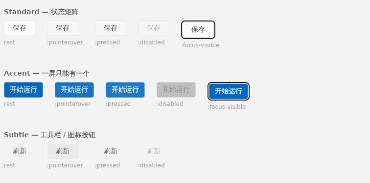

<div align="center">

# Cobalt.Fluent

**Windows 11 Fluent 控件库 for Avalonia**

57 个控件 · 11 组 · 明暗双主题 · **零第三方依赖** · 含一组工业 HMI 专用控件

[](https://github.com/RoorJiaMo/CobaltFluent/actions/workflows/build.yml)
[](LICENSE)
[](https://avaloniaui.net)
[](https://dotnet.microsoft.com)


</div>

---

## 它解决什么

做过程控制、设备上位机这类界面时，通用控件库总差一层：读数刷新会抖、报警靠闪烁、点动按钮松手不停、参数下发后显示的是你输进去的值而不是设备真正接受的值。这些不是审美问题，是**会出事故的问题**。

Cobalt.Fluent 把 Windows 11 Fluent 的视觉规格完整实现了一遍，然后在上面补了一组过程界面真正需要的控件，并且把安全语义写死在控件里、用回归测试钉住。

<table>
<tr>
<td width="25%" valign="top">

### 零第三方依赖

只用 Avalonia 本体、`Avalonia.Themes.Fluent`、`Avalonia.Controls.DataGrid` —— 三个都属于框架本体。图表是自绘的，图标是矢量路径。

</td>
<td width="25%" valign="top">

### 规格可验收

每个控件都有状态矩阵，48 个章节在 CI 里逐页无头渲染，96 张截图渲染不出来就算失败。

</td>
<td width="25%" valign="top">

### 嵌入式友好

不依赖 Segoe Fluent Icons，动效只动 transform 和 opacity，亚克力和微光都能一键关掉。

</td>
<td width="25%" valign="top">

### 安全有测试

急停自锁、点动七重停止、心跳由事件驱动、读数过期保留最后值 —— 每条都有回归测试。

</td>
</tr>
</table>

---

## 快速开始

```bash
dotnet add package Cobalt.Fluent
```

```xml
<!-- App.axaml -->
<Application xmlns="https://github.com/avaloniaui"
             xmlns:fc="using:Cobalt.Fluent">
  <Application.Styles>
    <fc:CobaltFluentTheme />
  </Application.Styles>
</Application>
```

切主题走 `Application.Current.RequestedThemeVariant`（`Light` / `Dark` / `Default`）。
本库新写的控件都在 `Cobalt.Fluent.Controls`：

```xml
xmlns:fc="using:Cobalt.Fluent.Controls"
```

```xml
<fc:Readout Label="腔体温度" Value="85.5" Unit="°C"
            Setpoint="85.0" Tolerance="1.0" Size="Large" />

<fc:JogButton Content="X+ 点动" StopCommand="{Binding StopAxis}"
              WatchdogTimeout="0:0:0.5" />

<fc:TrendChart Series="{Binding Channels}" TrackballEnabled="True" />
```

---

## 看一眼

<table>
<tr>
<td width="50%"></td>
<td width="50%"></td>
</tr>
<tr>
<td align="center"><sub>浅色 · 第 9 组 图表</sub></td>
<td align="center"><sub>深色 · 第 7 组 工业 HMI</sub></td>
</tr>
</table>

每一节都先摆状态矩阵、再给可操作的试玩实例，最后一块是这一节用到的资源键和伪类：



```bash
dotnet run --project samples/Cobalt.Fluent.Gallery    # 打开展柜
```

---

## 覆盖范围

11 组，桌面基准 32px。

<details>
<summary><b>展开完整清单（57 个控件）</b></summary>

<br>

| 组 | 控件 | 来源 |
|---|---|---|
| **2** 基础输入 | Button · ToggleButton · SplitButton · DropDownButton · HyperlinkButton · TextBox · NumberBox · ComboBox · CheckBox · RadioButton · ToggleSwitch · Slider | Avalonia 内置 + 本库 ControlTheme |
| **3** 容器 | Card · SettingsCard · SettingsGroup · Expander · TabControl · TabView · NavigationView | Card / SettingsCard / TabView / NavigationView 本库新写 |
| **4** 集合 | ListBox · DataGrid · TreeView | ListBoxItem 重做 Template（加选中指示条） |
| **5** 反馈 | InfoBar · InfoBadge · ProgressBar · ProgressRing · ToolTip | InfoBar / InfoBadge / ProgressRing 本库新写 |
| **6** 弹出 | Flyout · MenuFlyout · ContentDialog · TeachingTip · CommandBar | ContentDialog / TeachingTip / CommandBar 本库新写 |
| **7** HMI 专用 | Readout · StatusIndicator · AlarmBanner · ParameterRow · JogButton · EStopButton · DeviceStatusBar | 全部本库新写 |
| **8** 日期时间 | CalendarDatePicker · TimePicker · Calendar · RangeCalendar · DateRangePicker | 内置 + 本库 ControlTheme；RangeCalendar 补区间首尾伪类 |
| **9** 图表 | ChartFrame · TrendChart · Gauge · BarChart · Sparkline · ChartLegend | 全部本库自绘 |
| **10** 表格增强 | DataGridToolbar · Pagination · EmptyState · Skeleton | 全部本库新写 |
| **11** 常用补充 | AutoSuggestBox · BreadcrumbBar · SegmentedControl · Chip · Stepper · GridSplitter · Toast · PersonPicture | 除 AutoCompleteBox / GridSplitter 外本库新写 |

完整 API 见 [`docs/CONTROLS.md`](docs/CONTROLS.md)（73 个类型，从源码抽取）。

</details>

---

## 设计基线

四条硬规则，全库共用。它们不是风格偏好 —— 单看一个控件怎么画都说得通，十几个凑在一屏上，只有一致的层、圆角、阴影和字重才不会互相打架。

| | |
|---|---|
| **画面只有两层** | base layer（窗口底，导航和命令栏住这儿）+ content layer（内容区）。Card 是 content layer 内部的分区，不是第三层。 |
| **圆角只有 8 / 4 / 0** | 8 给弹出面板，4 给控件，0 给相接处。唯一例外是日历格的正圆。 |
| **阴影只给悬浮层** | ToolTip / Flyout / MenuFlyout / ContentDialog / TeachingTip，五个。页面内元素一律靠描边。 |
| **字重只有 400 / 600** | 没有 Bold，没有斜体 —— 中文没有真正的斜体，合成出来的小字号下糊成一团。 |

控件层**零裸色值**，颜色全部走 `DynamicResource`。换主题色、做高对比度、给不同产线定制外观，只动变量层，控件层一行不改。

---

## 工业 HMI（第 7 组）

WinUI 和 FluentAvalonia 里都没有这一组。它涉及人身和设备安全，所以下面每条都实现在控件里、并有回归测试钉着：

<details>
<summary><b>展开七条硬约束</b></summary>

<br>

- **安全色不跟随主题。** 急停和 Alarm 级报警用 `SafetyRedBrush`，不用 `SystemFillColorCriticalBrush` —— 后者在深色主题下是浅粉 `#FF99A4`，对需要立即处置的级别是错的。
- **报警用呼吸不用闪烁**（1.5s，opacity 1↔.62）。高频闪烁引发疲劳，且有光敏性癫痫风险。关掉动画后自动补安全黄描边，否则降级后 Alarm 和 Warning 分不出来。
- **`JogButton` 挂满七个停止触发点** —— 松手 / 捕获丢失 / 指针离开 / 失焦 / 松键 / 摘除 / 看门狗超时。只监听 `PointerReleased` 不够：按住后把指针拖出按钮，释放事件可能根本不在这个控件上触发，设备会一直动。
- **心跳灯由 `Beat()` 驱动**，不是固定周期动画。不喂就自己停跳 —— 通信断了心跳还在跳，操作员会以为系统活着，**比没有心跳灯更危险**。
- **`Readout` 过期时保留最后已知值**，只变灰 + 标注多久没更新。换成「—」是错的：通信断了，但设备上的反应还在跑，操作员需要知道断开前的最后一个值。
- **`ParameterRow` 下发成功后填回读值**，不是输入值 —— 设备可能限幅或量化。失败回滚到上次成功值。
- **软件急停不能替代硬件急停回路。** `EStopButton.HardwareLocationHint` 用来在界面上标注硬件急停的物理位置。

</details>

---

## 嵌入式 / 触摸屏

几个为 Mali GPU 这类场景留的开关：

| 场景 | 开关 |
|---|---|
| 一屏十几个运行指示灯 | `StatusIndicator.IsPulseEnabled="False"`（留静态外环，形状编码不丢） |
| 报警横幅呼吸动画 | `AlarmBanner.IsBreathingEnabled="False"`（自动补安全黄描边） |
| 骨架屏微光 | `Skeleton.IsShimmerEnabled="False"` |
| 长时间加载 | 用 `ProgressBar` 的 indeterminate 代替 `ProgressRing` —— 只动 transform |
| 亚克力（实时模糊） | 覆盖 `AcrylicBackgroundFillColorDefaultBrush` 为实色 |
| 触摸目标放大 | 覆盖 `ControlHeight` / `ControlCornerRadius` / `OverlayCornerRadius` |

图标不依赖 Segoe Fluent Icons：36 个字形全部画成矢量路径，跨平台像素一致，安装包里也不用塞字体。手上确实有那套字体的话，`SymbolIcon.UseGlyphFont="True"` 切回字体渲染。

---

## 开发

```bash
tools/check.sh                        # 编译控件库（复制到临时目录，不抢 obj 锁）
tools/check.sh --gallery              # 连展柜一起
tools/check.sh --only Button.axaml    # 只合并点名的控件层文件（并行开发用）

dotnet test tests/Cobalt.Fluent.Tests               # 57 项回归测试
dotnet run  --project samples/Cobalt.Fluent.Gallery # 打开展柜
```

四个生成物**必须和源码一起提交**，CI 会重跑脚本再比对，不同步就红：

```bash
python3 tools/gen_tokens.py          # tools/palette.json → Themes/Tokens.axaml
python3 tools/gen_theme_index.py     # 控件层合并列表（编译前自动跑）
python3 tools/gen_gallery_pages.py   # 展柜目录和章节骨架
python3 tools/gen_api_docs.py        # docs/CONTROLS.md
```

无头渲染截图，肉眼验收用；CI 里也跑一遍，渲染不出来就是错：

```bash
dotnet run --project tools/Cobalt.Fluent.Shots -- artifacts/shots Button both
dotnet run --project tools/Cobalt.Fluent.Shots -- artifacts/shots "shell:Readout" dark
```

---

## 文档

| | |
|---|---|
| [`docs/CONVENTIONS.md`](docs/CONVENTIONS.md) | 写法约定 —— 分层、资源键速查、伪类清单、不能破坏的不变量，以及几个编译期发现不了的坑 |
| [`docs/CONTROLS.md`](docs/CONTROLS.md) | 控件 API（73 个类型，由 `tools/gen_api_docs.py` 从源码抽取） |
| 展柜 | 48 个章节，每节 = 规格 + 状态矩阵 + 试玩 + 资源键对照 |

改控件之前先读 `CONVENTIONS.md`。提 PR 前本地至少跑一遍编译、测试和两个生成脚本 —— CI 跑的就是这几条，外加把 48 个章节全部无头渲染一遍。

---

## License

[MIT](LICENSE)

依赖的 Avalonia（本体、`Avalonia.Themes.Fluent`、`Avalonia.Controls.DataGrid`）同样是 MIT，归 [AvaloniaUI OÜ](https://github.com/AvaloniaUI/Avalonia) 及其贡献者。本库不打包、不转发它们的源码，只在 `PackageReference` 里引用。

设计语言参照微软的 Windows 11 Fluent Design System；实现是独立写的，不包含微软的任何代码或资源。图标是重画的矢量路径，不是 Segoe Fluent Icons 的字形文件。
